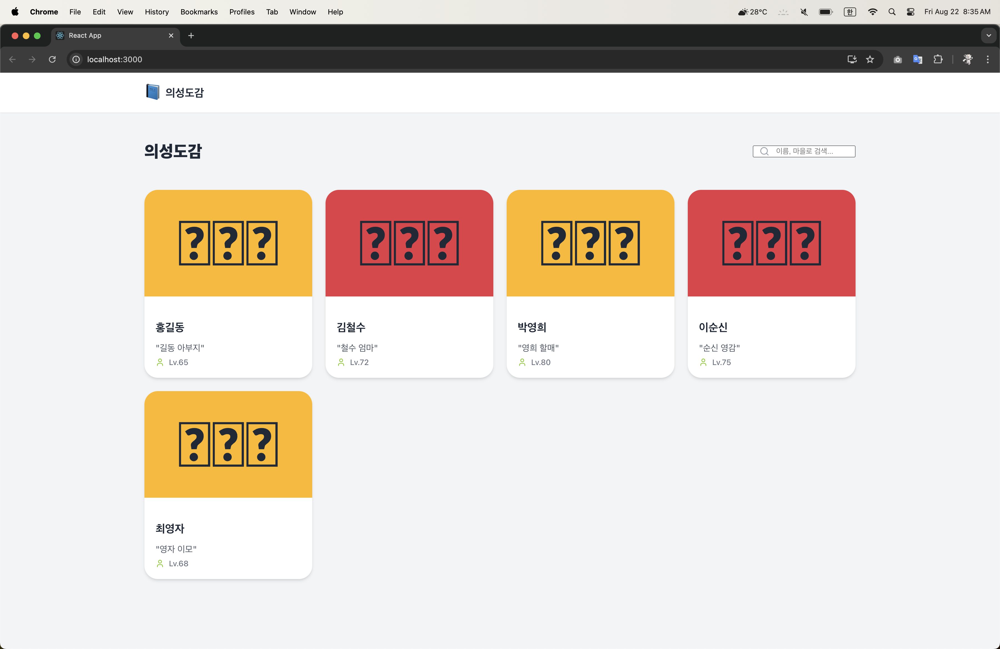

# uiseongbook-web

의성도감 프론트엔드 웹 입니다

## Run

로컬에서 실행하는 방법 입니다.

1. 저장소 클론을 받습니다
   ```
   git clone https://github.com/jeesang7/uiseongbook-web.git
   ```
2. `npm start` 명령어 실행합니다
3. 브라우저에서 `http://localhost:3000` 접속해서 볼 수 있습니다

